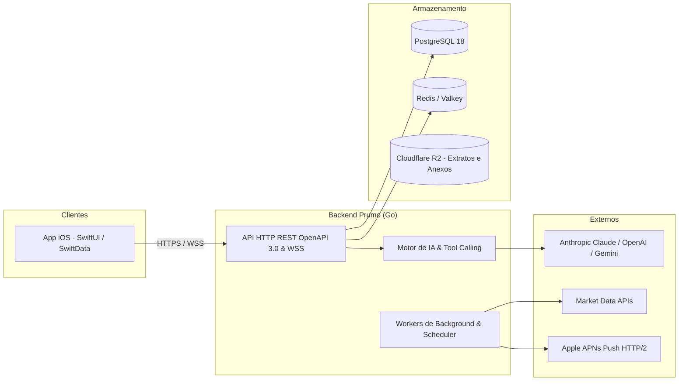
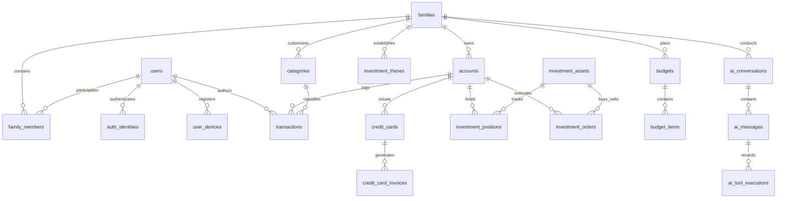

# Prumo — Arquitetura de Software

> **Status**: Ativo · **Versão**: 1.0 · **Data**: 2026-08-18

---

## 1. Visão Geral
O **Prumo** adota arquitetura de monólito modular em **Go (Go 1.24+)** servindo API REST OpenAPI 3.0 via **Chi + Huma v2** e WebSocket para streaming de IA em tempo real. A camada de persistência utiliza **PostgreSQL 18** com acesso fortemente tipado gerado por **sqlc** e migrações versionadas com **golang-migrate**. O aplicativo cliente é desenvolvido em **SwiftUI (Swift 6)** nativo para iOS, com geração de projeto desacoplada via **XcodeGen**.

---

## 2. Decisões Arquiteturais Fundamentais

| Decisão | Escolha | Motivo |
|---|---|---|
| **Arquitetura do Backend** | Go (Monólito Modular) | Binário único, performance superior, concorrência idiomática e baixo consumo de memória. |
| **API & Contratos** | Chi + Huma v2 (OpenAPI 3.0) | Validação automática com JSON Schemas, documentação viva nativa e tipagem estrita de payloads. |
| **Persistência Relacional** | PostgreSQL 18 + `sqlc` + `golang-migrate` | SQL nativo compilado sem overhead de ORMs; type-safety garantido em tempo de build. |
| **Quality Gate de Banco** | `sqlcprepare` | Executa `PREPARE` de todas as queries contra o Postgres para evitar bugs de tipos de parâmetros (ex: 42P08). |
| **App Mobile** | SwiftUI nativo (iOS 17+) com XcodeGen | Interface fluida, animações no padrão iOS HIG, sem conflitos de merge no `.xcodeproj`. |
| **Segurança da IA** | Function Calling com Aprovação em 2 Etapas | Ações financeiras de escrita requerem `approval_token` e confirmação explícita do usuário na UI. |

---

## 3. Diagrama Entidade-Relacionamento do Banco de Dados

