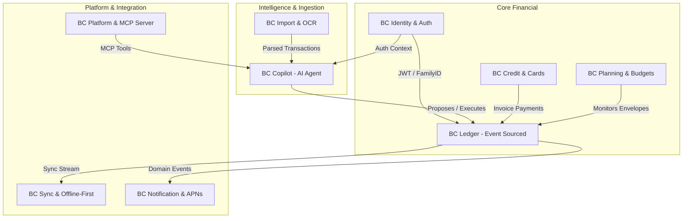

# Prumo — Arquitetura de Software & Bounded Contexts

> **Documento Arquitetural Central (C4 Model & Domain-Driven Design)**  
> **Status:** Ativo · **Versão:** 2.0 · **Padrão:** Modular Monolith Preparado para Microsserviços

---

## 1. Visão Geral e Filosofia Arquitetural

O **Prumo** adota o padrão **Monolith-First Modular em Go**, estruturado estritamente em torno de **Bounded Contexts (DDD)** com portas e adaptadores (Arquitetura Hexagonal).

### Por que Modular Monolith com Prontidão para Microsserviços?
1. **Zero Sobrecarga de Rede no MVP**: Todos os Bounded Contexts rodam no mesmo processo em Go, comunicando-se via interfaces tipadas (`Ports`) e eventos in-process (`EventBus`).
2. **Fronteiras Rígidas de Módulos (`internal/<bc>/`)**: Nenhum Bounded Context importa structs internas de outro. Toda dependência cross-context ocorre via eventos ou portas públicas.
3. **Extração Trivial para Microsserviços Independentes**: Quando um contexto exigir escala dedicada (ex: `Copilot` com alto consumo de memória/CPU ou `Sync` com alta concorrência de conexões WebSocket/gRPC), o módulo pode ser extraído para um binário autônomo sem refatorar o código de domínio.

---

## 2. Mapa dos 9 Bounded Contexts



---

## 3. Especificação dos Bounded Contexts

### 3.1 `Identity` (Identidade, Autenticação & Multi-Tenancy)
- **Responsabilidade**: Cadastro, autenticação (Password, Magic Link, Sign in with Apple), gestão de núcleos familiares (`families`), membros e RBAC (`owner`, `admin`, `member`, `viewer`).
- **Invariantes**: Isolamento rigoroso por `family_id` em todas as tabelas financeiras.

### 3.2 `Ledger` (Livro-Razão & Movimentações — *Event-Sourced*)
- **Responsabilidade**: Contas correntes, poupanças, carteiras, categorias hierárquicas (13 raízes semânticas do ADR-0002) e transações financeiras.
- **Invariantes**: 
  - Valores monetários em inteiros (`bigint` em centavos).
  - Transferências geram duas pernas atômicas com `TransferGroupID`.
  - Histórico imutável de movimentações.

### 3.3 `Credit` (Cartões de Crédito, Faturas & Parcelamentos)
- **Responsabilidade**: Cartões de crédito, ciclo de faturas (fechamento/vencimento), distribuição de compras parceladas mês a mês, divisão de gastos por portador do cartão e antecipação com desconto a valor presente.

### 3.4 `Planning` (Orçamentos por Envelope & Metas Familiares)
- **Responsabilidade**: Envelopes mensais por categoria, cálculo de Realizado vs. Orçado, transição de cores de risco e cálculo do valor "Livre para Investir".

### 3.5 `Copilot` (Agente de IA Agêntica & Automação Inteligente)
- **Responsabilidade**: Orquestrador conversacional de IA (Anthropic/OpenAI/Gemini), streaming SSE, execução de *Function Calling* e dois modos operacionais (**Confirmação** com aprovação *Human-in-the-Loop* e **Autônomo** para rotinas de baixo risco com Undo de 30 dias).
- **Segurança**: Tokenização determinística de PII e Hard Cap de custos de inferência (burn cap).

### 3.6 `Import` (Canais de Ingestão & OCR)
- **Responsabilidade**: Parser de faturas em PDF, arquivos OFX/CSV, e-mails encaminhados e comprovantes fotográficos, direcionando dados com baixa confiança para o inbox transitório `uncategorized`.

### 3.7 `Notification` (Alertas & Notificações Push)
- **Responsabilidade**: Envio de push notifications nativas (APNs via HTTP/2) e e-mails transacionais.

### 3.8 `Sync` (Sincronização Bidirecional & Offline-First)
- **Responsabilidade**: Mecanismo de sincronização delta em background e resolução de conflitos baseado em CRDT / LWW (Last-Write-Wins) para clientes offline no iOS.

### 3.9 `Platform` (Extensibilidade & Servidor MCP)
- **Responsabilidade**: Exposição de ferramentas financeiras estruturadas através do **Model Context Protocol (MCP)** para integração com Claude Desktop, Cursor, Antigravity e agentes externos.

---

## 4. Estrutura do Repositório (Alinhamento Modular)

```
backend/
├── cmd/
│   ├── server/               # Ponto de entrada do Modular Monolith (Go 1.24)
│   ├── sqlcprepare/          # Quality gate de validação de queries SQL
│   └── mcp-server/           # Ponto de entrada alternativo para o servidor MCP
├── internal/
│   ├── identity/             # Bounded Context: Identity & Auth
│   ├── ledger/               # Bounded Context: Ledger & Categories
│   ├── credit/               # Bounded Context: Cards & Statements
│   ├── planning/             # Bounded Context: Budgets & Goals
│   ├── copilot/              # Bounded Context: AI Agent & LLM Adapters
│   ├── import/               # Bounded Context: PDF/OFX Parsers
│   ├── notification/         # Bounded Context: APNs & Email
│   ├── sync/                 # Bounded Context: Delta Sync Engine
│   └── platform/             # Bounded Context: MCP Tools & Exports
├── pkg/
│   ├── eventbus/             # Barramento de eventos in-process / async
│   ├── pii/                  # Tokenizador e mascarador de dados sensíveis
│   ├── money/                # Tipos e utilitários monetários seguros em centavos
│   └── problem/              # Respostas de erro padronizadas RFC 7807
└── db/
    ├── migrations/           # Migrations sequenciais DDL
    └── queries/              # Queries SQL tipadas por Bounded Context
```

---

## 5. Estratégia de Evolução para Microsserviços

Se no futuro um dos Bounded Contexts exigir escala isolada ou equipe dedicada:
1. **Passo 1**: Substituir as chamadas in-process do `Port` por um adapter gRPC ou HTTP Connect.
2. **Passo 2**: Mover a pasta `internal/<bc>` para seu próprio repositório/container `cmd/<bc>-service`.
3. **Passo 3**: Plugar o barramento de eventos local no Apache Kafka ou NATS JetStream.
Zero impacto no código de domínio ou nas regras de negócio financeiras.
