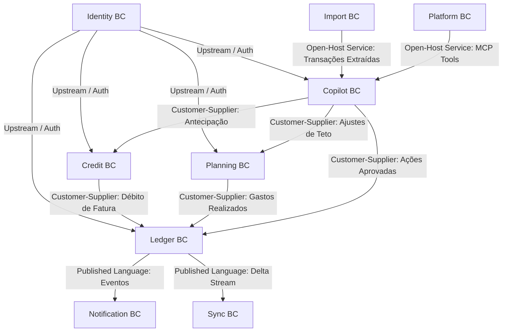

# Prumo — Catálogo Detalhado dos 9 Bounded Contexts

> **Domain-Driven Design (DDD) & Contratos de Domínio**  
> **Status:** Ativo · **Versão:** 1.0

---

## 1. Mapa de Relacionamentos (Context Map)

---

## 2. Detalhamento por Bounded Context

### 1. `Identity`
- **Agregados**: `User`, `Family`, `FamilyMember`, `RefreshToken`.
- **Comandos**: `RegisterUser`, `LoginUser`, `CreateFamily`, `InviteMember`, `UpdateMemberRole`, `RevokeSession`.
- **Eventos**: `UserRegistered`, `MemberAddedToFamily`, `SessionRevoked`.

### 2. `Ledger` (Event-Sourced Core)
- **Agregados**: `Account`, `Category` (13 raízes semânticas + subcategorias), `Transaction` (com suporte a splits).
- **Comandos**: `CreateAccount`, `PostTransaction`, `TransferFunds`, `SplitTransaction`, `ArchiveAccount`.
- **Eventos**: `TransactionPosted`, `FundsTransferred`, `AccountArchived`.

### 3. `Credit`
- **Agregados**: `CreditCard`, `Invoice` (Statement), `InstallmentPlan`.
- **Comandos**: `CreateCreditCard`, `PostCardExpense`, `CalculateInvoiceInstallments`, `AnticipateInstallmentWithDiscount`, `PayInvoice`.
- **Eventos**: `InvoiceClosed`, `InstallmentAnticipated`, `InvoicePaid`.

### 4. `Planning`
- **Agregados**: `MonthlyBudget`, `BudgetEnvelope`, `FinancialGoal`.
- **Comandos**: `SetBudgetEnvelope`, `RecalculateEnvelopes`, `CreateGoal`, `ContributeToGoal`.
- **Eventos**: `BudgetThresholdExceeded`, `GoalAchieved`.

### 5. `Copilot` (AI Native Engine)
- **Agregados**: `AIConversation`, `AIAction`, `AuditEntry`, `UsageQuota`.
- **Comandos**: `SendUserPrompt`, `ProposeAIAction`, `ApproveAIAction`, `ExecuteAIAction`, `UndoAIAction`.
- **Eventos**: `AIActionProposed`, `AIActionExecuted`, `AIActionUndone`, `BurnCapThresholdReached`.

### 6. `Import`
- **Agregados**: `ImportJob`, `ExtractedDocument`.
- **Comandos**: `SubmitPDFInvoice`, `ParseOFXFile`, `ExtractReceiptPhoto`.
- **Eventos**: `DocumentParsed`, `LowConfidenceTransactionsMovedToUncategorized`.

### 7. `Notification`
- **Agregados**: `NotificationPreference`, `PushSubscription`.
- **Comandos**: `SendPushNotification`, `SendTransactionalEmail`.

### 8. `Sync`
- **Agregados**: `DeviceSyncState`, `SyncChangeLog`.
- **Comandos**: `PullDeltaChanges`, `PushDeltaChanges`.

### 9. `Platform`
- **Agregados**: `MCPServerSession`, `DataExportJob`.
- **Comandos**: `ExecuteMCPTool`, `ExportFinancialData`.
